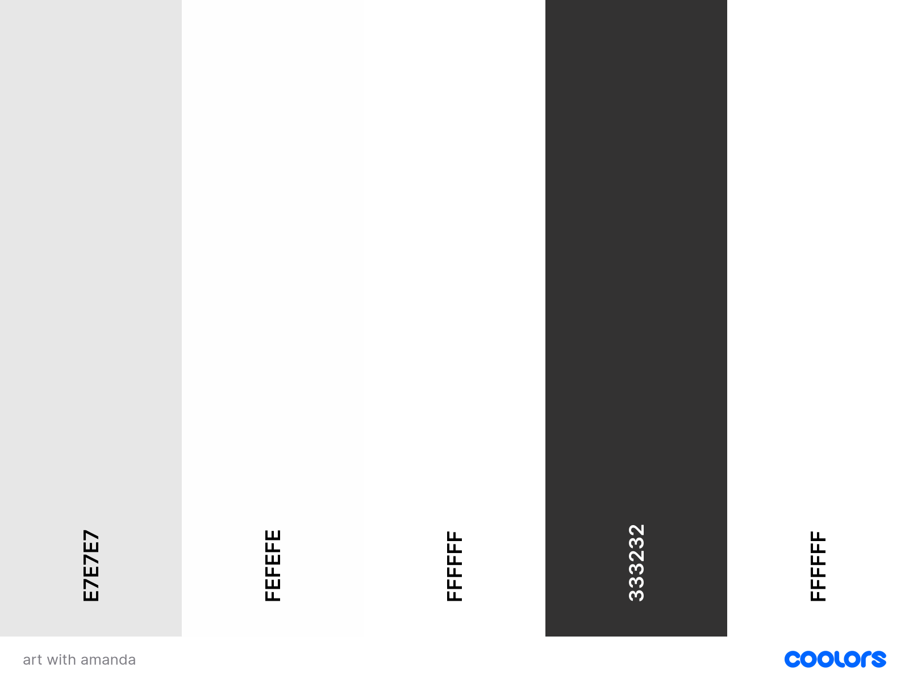

# Art with Amanda 

Art with Amanda is a full-stack e-commerce website that I developed as my final milestone project for the Level 5 Diploma in Web Development with Code Institute. As an artist, I built this platform using Django, Python, HTML, CSS, and JavaScript to showcase and sell my original artworks and prints. With Stripe integration for secure payments, the website provides a user-friendly interface where visitors can explore a diverse collection of my artwork, view detailed descriptions, and make purchases seamlessly. This project not only highlights my artistic endeavors but also demonstrates my proficiency in web development, combining my passion for art with modern technologies to create an engaging online gallery experience.

[View website here](https://art-with-amanda-fc934063cf38.herokuapp.com/)


# Table of Contents

1. [User Experience](#user-experience)
    - [Project Goals](#project-goals)
    - [User Feedback and Involvement](#user-feedback-and-involvement)
    - [User Stories](#project-goals)
    - [Database Schema](#database-schema)
    - [Wireframes](#wireframes)
    - [Colour Scheme](#colour-scheme)
    - [Typography](#typography)
    - [Imagery](#imagery)
    - [Mockup](#mockup)
2. [Rationalle for Development](#rationalle-for-development)
3. [Features](#features)
4. [Technologies Used](#technologies-used)
    -  [Languages](#languages)
    -  [Frameworks & Tools](#frameworks--tools)
4. [Testing](#testing)
5. [Deployment](#deployment)
6. [Credits](#credits) 
    -  [Media](#media)
    -  [Code](#code)

# User Experience 

## Project Goals

### Site Owner Goals

As the site owner of Art with Amanda, my primary goals for this website are to:

1. **Showcase Artwork**: Provide a visually appealing platform to display my art collections, allowing visitors to appreciate and engage with my work.

2. **Sell Artworks**: Implement a seamless e-commerce experience where users can purchase my artworks easily and securely through Stripe integration.

3. **Expand Reach**: Reach a broader audience by making my artwork accessible online, thus attracting potential buyers and art enthusiasts from different regions.

4. **Enhance User Experience**: Ensure a user-friendly interface with intuitive navigation, making it easy for visitors to explore the site, view detailed artwork descriptions, and complete transactions.

5. **Promote Brand Identity**: Strengthen my brand presence by maintaining a consistent aesthetic and professional presentation across the website.

By achieving these goals, I aim to not only sell my artworks but also build a lasting connection with my audience and grow my presence in the art community.

### User Goals

As a visitor to the Art with Amanda website, my goals are to:

- **Discover Art**: Easily explore a diverse collection of artwork presented in a visually appealing manner.

- **View Art Details**: Access detailed information about each artwork, including descriptions, dimensions, materials used, and pricing.

- **Purchase Art**: Seamlessly browse through available artworks, add desired items to a shopping cart, and securely complete the purchase using Stripe integration.

- **Navigate Easily**: Find my way around the website intuitively, with clear categories, and an easy-to-use interface.

- **Learn About the Artist**: Gain insights into Amanda’s artistic journey, background, and inspiration, establishing a connection with the artist.

- **Contact Artist**: Easily reach out to Amanda for inquiries, commissions, or collaborations through a contact form or provided contact details.

- **Enjoy a Seamless Experience**: Experience a responsive website that works well on different devices, ensuring a consistent and enjoyable browsing and shopping experience.

By achieving these goals, users can explore and appreciate my artwork, make informed purchasing decisions, and potentially become patrons and supporters of my artistic journey.

## User Feedback and Involvement

### Feedback Collection

Before the development of Art with Amanda began, user feedback was actively collected to ensure the website meets the needs and expectations of its target audience. Feedback was gathered through various channels, including:

- **Preliminary Discussions**: Had discussions and gathered suggestions from art friends and family members to understand their preferences, behaviors, and needs as potential buyers and art enthusiasts.

- **Instagram Community Feedback**: Posted questions and polls on my Instagram story (artwithamanda_) asking followers what they would like to see on an art selling website and gathered valuable feedback and suggestions.

### Key Points from Feedback

After collecting extensive feedback from both my Instagram community and preliminary discussions with friends and family, several key points emerged. Here are the questions I asked and a summary of the majority responses:

1. **What do you want to see on an art seller's website?**
    - High-quality images of the artwork
    - Detailed descriptions and background stories of each piece
    - Easy navigation and categorization of art pieces

2. **What features do you find most helpful in making purchasing decisions?**
    - Clear pricing and size information
    - User reviews and ratings
    - Secure and straightforward payment options

3. **What design elements do you prefer in an art selling website?**
    - Clean and minimalist design
    - High-contrast colour schemes to highlight the artwork
    - Intuitive layout with easy access to different sections

4. **How important is mobile responsiveness to your browsing experience?**
    - Extremely important: The majority of users emphasized the need for a mobile-friendly design
    - Users expect a seamless experience across all devices

#### Screenshots of Questions:
- [Question 1 Screenshot](documentation/UserFeedbackQS/Q1.JPG)
- [Question 2 Screenshot](documentation/UserFeedbackQS/Q2.JPG)
- [Question 3 Screenshot](documentation/UserFeedbackQS/Q3.JPG)
- [Question 4 Screenshot](documentation/UserFeedbackQS/Q4.JPG)

### Poll Results

Here are the results of the polls:

- [Poll 1 Screenshot](documentation/UserFeedbackPolls/IMG_3129.PNG)
- [Poll 2 Screenshot](documentation/UserFeedbackPolls/IMG_3130.jpg)
- [Poll 3 Screenshot](documentation/UserFeedbackPolls/IMG_3131.jpg)
- [Poll 4 Screenshot](documentation/UserFeedbackPolls/IMG_3132.jpg)
- [Poll 5 Screenshot](documentation/UserFeedbackPolls/IMG_3133.jpg)

### Incorporating Feedback

User feedback played a crucial role in shaping the development of Art with Amanda. While I took into account the suggestions and preferences of my community, it's also important to maintain my own vision and personal style for the website. Key areas where feedback influenced decision-making include:

- **Navigation Improvements**: Made adjustments to improve the clarity and intuitiveness of the website's navigation menus and category organization based on expected user feedback.

- **Content Presentation**: Enhanced how information such as descriptions, dimensions, and materials used is displayed to users, ensuring a more informative and engaging experience.

- **Mobile Responsiveness**: Optimized the website to ensure a seamless browsing and shopping experience across various devices and screen sizes.

- **Design Choices**: For aspects like typography and colour schemes, I provided options that I liked and then asked the Instagram community to vote on their preferences. This collaborative approach ensured that the final design elements resonated well with the broader audience while still reflecting my artistic vision.

### Continuous Improvement

User feedback remains an important part of Art with Amanda's ongoing development and growth strategy. I will continue to actively seek suggestions and feedback from the audience throughout the development process, periodically asking for input on my Instagram and from friends and family. This approach ensures that the website evolves to meet the preferences and needs of its users, maintaining a user-centric approach to its development.

## User Stories
| User Story ID | As a/an | I want to be able to ... | So that I can... |
| :--- | :--- | :--- | :---|
| **VIEWING & NAVIGATION** |
| 1 | Shopper | Easily navigate the site | find artwork/information that I need. |
| 2 | Shopper | Easily contact the artist | ask any questions about anything I'm interested in, like a commission. |
| 3 | Shopper | Learn about the artist | gain insights into the artist's background and journey. |
| 4 | Shopper | View a category/filter of artwork, e.g., originals/prints | find specific art items I am interested in without having to scroll through all artwork. |
| 5 | Shopper | View more details on artwork | see descriptions, dimensions, material used, and sizing. |
| 6 | Shopper | View my running total of purchases throughout my visit | make sure I don't overspend & can track whether I meet any site offers (e.g., free delivery). |
| **REGISTRATION & USER ACCOUNTS** |
| 7 | Shopper | Easily register for an account | have a personal account and view my profile. |
| 8 | Shopper | Receive an email to confirm my registration | verify my account was created successfully. |
| 9 | Shopper | Log in and out | access my personal account and keep my account information secure. |
| 10 | Shopper | View a profile page | view my previous orders and key information. |
| 11 | Shopper | Reset my password | recover access to my account. |
| **SORTING & SEARCHING** |
| 12 | Shopper | Sort the list of available artworks | easily identify the best-priced and categorically sorted artworks. |
| 13 | Shopper | Sort a specific category of artworks | find the best-priced artwork in a specific category, or sort the artworks by name. |
| 14 | Shopper | Easily see what I've searched for and the number of results | quickly decide whether the product I want is available. |
| **PURCHASING & CHECKOUT** |
| 15 | Shopper | Easily select size and quantity of artwork when purchasing it | ensure I don't select the wrong size or quantity. |
| 16 | Shopper | View items in my bag to be purchased | see the total cost of my purchase and all items I will receive. |
| 17 | Shopper | Adjust the quantity of individual items in my bag | easily make changes to my purchase before checkout. |
| 18 | Shopper | Easily enter my payment information | check out quickly and with no problems. |
| 19 | Shopper | Feel my personal and payment information is safe and secure | confidently provide the needed information to make a purchase. |
| 20 | Shopper | View an order confirmation after checkout | verify that I haven't made any mistakes. |
| 21 | Shopper | Receive an email confirmation after checking out | keep the confirmation of what I've purchased for my records. |
| **ADMIN & STORE MANAGEMENT** |
| 22 | Store Owner | Add artwork | add new art pieces to my store. |
| 23 | Store Owner | Edit/update a product | change art piece prices, descriptions, images, and other criteria. |
| 24 | Store Owner | Delete a product | remove items that are no longer for sale. |

## Database schema 

## Wireframes
In the initial stages of designing Art with Amanda, I created rough sketches to visualize the layout and structure of the website. These sketches served as a blueprint for the final wireframes and helped shape the overall user experience. Below are the images of these sketches:
- [Photo 1](documentation/Wireframes1/IMG_3139.jpg)
- [Photo 2](documentation/Wireframes1/IMG_3140_2.jpg)
- [Photo 3](documentation/Wireframes1/IMG_3141_2.jpg)
- [Photo 4](documentation/Wireframes1/IMG_3142_2.jpg)

### Final Wireframes

After refining my initial sketches, I created detailed wireframes using Figma, a versatile and powerful design tool known for its collaborative features and ease of use. Figma allowed me to add images and create precise, polished representations of the website's layout. Below are the finalized wireframes:

#### Home Page

For the home page, I developed two different options and sought feedback from the Instagram community, as well as from family and friends, to determine which layout they preferred. The majority favored the first layout, so I decided to proceed with this design.

- **Option 1**: [View Wireframe](documentation/FinalWireframes/wf1.png)
- **Option 2**: [View Wireframe](documentation/FinalWireframes/wf2.png)
- **Phone View**: [View Wireframe](documentation/FinalWireframes/homepagephone.png)
- **Tablet View**: [View Wireframe](documentation/FinalWireframes/homepagetablet.png)

#### Shop Page

The shop page was designed to provide a seamless shopping experience across different devices. It features a clean layout that highlights the products, with easy filtering and sorting options to help users find what they are looking for quickly. The wireframes include detailed views for different devices:

- **Desktop View**: [View Wireframe](documentation/FinalWireframes/Screenshot%202024-06-18%20at%2014.52.42.png)
- **Phone View**: [View Wireframe](documentation/FinalWireframes/shoppagephone.png)
- **Tablet View**: [View Wireframe](documentation/FinalWireframes/Screenshot%202024-06-18%20at%2014.56.13.png)

#### Art Product Page

The art product page showcases individual artworks with detailed descriptions and images. This page is designed to provide all the necessary information about each piece, including high-quality images, descriptions, quantity, and pricing. The wireframes demonstrate how these elements are organized for clarity and ease of use:

- **Desktop View**: [View Wireframe](documentation/FinalWireframes/artfdetaildesktop.png)
- **Phone View**: [View Wireframe](documentation/FinalWireframes/artdetailphone.png)

#### Contact Page

The contact page ensures users can easily reach out with inquiries or feedback. It includes a straightforward contact form, clear instructions, and additional contact information such as email and phone numbers. This page is designed to be user-friendly and accessible:

- **Desktop View**: [View Wireframe](documentation/FinalWireframes/contactpagedesktop.png)

#### Account/Login/Sign Up Page

The account, login, and sign up pages were designed to streamline the user authentication process, ensuring a smooth and user-friendly experience. These wireframes include the following features:

- **Account Page**: Allows users to view and update their personal information, manage their password, and view their order history.
- **Login Page**: Provides a simple and secure interface for users to enter their credentials and access their accounts. It includes options for forgotten passwords and social media logins.
- **Sign Up Page**: Offers a straightforward registration form for new users, with fields for necessary personal information and security features to protect user data.

#### Shopping Bag Page

The shopping bag page wireframes were designed to provide users with a clear overview of their selected items, allowing for easy modifications to quantities and facilitating a straightforward checkout process. Key features include:

- **Item List**: Displays all selected items with thumbnails, names, prices, and quantity selectors.
- **Total Price**: Shows a summary of the total cost.
- **Checkout Button**: A prominent button that directs users to the secure checkout page.
- **Remove Item Option**: Allows users to easily remove items from their shopping bag.

### Next Steps

With the wireframes finalized, I used them as a blueprint during the development phase to ensure the website aligns with the chosen layout and effectively meets user needs.

## Colour Scheme

In developing the Art with Amanda website, I prioritized a modern and simplistic design to ensure that my artwork remains the focal point. Based on user feedback, I selected a colour palette consisting of different shades of white and black. This neutral colour scheme helps to create a clean, elegant, and professional look that doesn't distract from the art photos.

<details>
<summary>Colour Palette</summary>
<br>

</details>

The following is an overview of how the colour scheme is applied across different sections of the website:

- **Backgrounds**: The primary background colour is white, providing a bright and clean canvas for the artwork.
- **Text**: The main text colour is black, and white on dark backgrounds, ensuring high readability and contrast.
- **Borders and Dividers**: A light grey is used for subtle borders and dividers, adding structure to the layout without drawing attention away from the artwork.
- **Buttons and Links**: Buttons and interactive elements are styled in a black shade to stand out and be easily identifiable.

### User Feedback Integration

The decision to use a simple and neutral colour scheme was directly influenced by user feedback. Through preliminary discussions and Instagram polls, users expressed a preference for a minimalist design that highlights the artwork rather than the website itself. By adopting this feedback, the final colour scheme enhances the user experience and ensures that the artwork remains the central focus of the site.

By maintaining a consistent and simplistic colour scheme, the website provides a cohesive and enjoyable user experience that directs attention to the artwork while ensuring readability and ease of navigation.

## Typography

The typography for the Art with Amanda website is inspired by my logo, which features the Arapey font. To complement Arapey, I researched fonts that pair well with it and discovered Raleway. This combination was recommended by a resource on the best free Google Fonts, which you can find [here](https://daveyandkrista.com/best-free-google-fonts/#:~:text=Arapey%20would%20look%20great%20in,serif%20like%20Questrial%20or%20Raleway.).

### Font Choices

- **Arapey**: This elegant serif font is used for the headings. Its classic and sophisticated style adds a touch of refinement to the website, making it ideal for drawing attention to key areas like titles and section headers.
- **Raleway**: This clean and modern sans-serif font is used for body text. Raleway’s readability and contemporary appearance provide a nice contrast to Arapey, ensuring that the content is easy to read and visually appealing.

### Application

The consistent use of these two fonts helps to create a cohesive and elegant look throughout the website. Here is how they are applied:

- **Headings (Arapey)**: All major headings, including section titles use the Arapey font. This helps to create a hierarchy and guide the user’s attention to important information.
- **Body Text (Raleway)**: All body text, including descriptions and general content, uses the Raleway font. This ensures that the text is clear and easy to read, contributing to a pleasant user experience.

By carefully selecting and pairing these fonts, the website achieves a harmonious visual experience that enhances readability while maintaining an elegant and professional appearance. This thoughtful typography choice reflects the overall aesthetic of the Art with Amanda brand, balancing artistic elegance with modern design principles.

## Imagery

The imagery for the Art with Amanda website plays a crucial role in showcasing the artwork in its best light. All photographs of my art are captured using an iPhone 12, which is the primary camera I have available. I aim to capture the artworks as close to their real appearance as possible, with minimal editing to ensure authenticity and preserve the artwork's natural beauty.

### Photography Process

1. **Capture**: Using the iPhone 12, I carefully photograph each artwork to ensure that the colours are accurate and the details are captured as they appear in real life.
   
2. **Minimal Editing**: After capturing the photos, I may do some simple edits to enhance the photograph and ensure it accurately represents the artwork's beauty. This may include adjusting brightness, contrast, and colour saturation to match the artwork's true appearance.

### Importance of Authentic Imagery

Authentic and high-quality imagery is crucial for an online art gallery as it allows potential buyers to see the artwork in detail and make informed decisions about their purchases. By using the iPhone 12 as my primary camera and minimizing editing, I ensure that each piece is represented authentically, creating a compelling visual experience for visitors to the website.

### Sample Photographs

Here are some examples of the artwork photographs taken with the iPhone 12 for the Art with Amanda website:

- [Photo 1](documentation/Imagery/jake_drawing.jpg)
- [Photo 2](documentation/Imagery/IMG_3255.jpg)
- [Photo 3](documentation/Imagery/zoOQO.jpeg)

These photographs demonstrate the clarity, detail, and colours captured with the iPhone 12, providing potential buyers with a true-to-life view of the artwork available for purchase.

## Mockup
For the Art with Amanda website, I created mockups to visualize the layout and design before development. These mockups were created using Wix, allowing me to experiment with different designs and user interfaces. Mockups help in understanding the overall structure of the website and provide a preview of how the final product will look and feel.

### Mockup Tool Used

I used **Wix** to create the mockups for Art with Amanda. Wix's drag-and-drop interface enabled me to design and customize various elements of the website easily.

### Screens Mocked Up

I created mockups for six key screens to explore different aspects of the website:

1. **Home Page**: This includes the main landing area, about the artist, and navigation.

2. **Artwork Listing Page**: A page showcasing all artworks with filtering and sorting options.

3. **Artwork Detail Page**: Detailed view of a single artwork with description, price, and options to purchase.

5. **Contact Page**: Form for visitors to reach out to Amanda for inquiries, commissions, or collaborations.

6. **Shopping Cart and Checkout**: Layout for viewing items in the cart, adjusting quantities, and completing the purchase through Stripe integration.

### Benefits of Mockups

- **Visualization**: Mockups provide a visual representation of the website's structure and layout.
- **Feedback**: They help gather feedback from stakeholders and potential users before development.
- **Planning**: Mockups aid in planning the user experience (UX) and user interface (UI) design.

### Example Mockup

Below is an example of the mockup for the Home Page created using Wix:

- [Home Page Mockup](documentation/Screenshot%202024-06-17%20at%2019.39.39.png)

### Next Steps

With the mockups finalized, I used them as a reference during the development phase to ensure the website aligns with the original vision and meets user needs effectively.

# Rationale for Development

The development of Art with Amanda was driven by several key factors:

1. **Market Demand**: There is a growing demand for unique, accessible, and online artwork purchasing options. This website aims to meet this demand by providing a platform for art enthusiasts to discover and purchase original artworks and prints.

2. **Personal Brand Growth**: As an artist, creating an online presence is crucial for expanding reach and establishing a brand. This website serves as a central hub for showcasing my work and interacting with potential buyers.

3. **User-Centric Design**: By prioritizing user feedback and involvement, the website development process ensures that the end product is aligned with user needs and preferences, enhancing the overall user experience.

4. **Technology Integration**: Leveraging modern web development technologies, such as Django for the backend and Stripe for secure payments, ensures a robust, scalable, and secure platform.

5. **Educational Milestone**: This project represents a significant milestone in my web development education, demonstrating the practical application of skills learned during my Level 5 Diploma in Web Development with Code Institute.

# Features

The following features are consistently present on all website pages, ensuring a cohesive and user-friendly experience:

### Navbar

- **Branding**: Displays the website's brand "ART WITH AMANDA" that links to the homepage.
- **Responsive Navigation**: A collapsible navbar that adjusts for different screen sizes, ensuring easy navigation on mobile devices.
- **Navigation Links**: Links to key pages like Home, Gallery, Shop, and Contact.
- **User Account Dropdown**: Provides account management options, including login, signup, profile management, and logout for authenticated users. Additionally, offers a product management link for superusers.
- **Shopping Bag Icon**: Displays a shopping bag icon with a dynamic count of artworks in the bag, enhancing the user shopping experience.

### Footer

#### Social Media Integration

- **Instagram Link**: An icon linking to the website's Instagram page, allowing users to follow and interact on social media.
- **Footer Branding**: Repeats the website's branding in the footer for consistent branding and easy navigation.

## Home Page Features

### Welcome Section
- **Introduction**: This section warmly welcomes visitors to the site, introduces Amanda, a beginner artist from the UK, and invites users to explore her art collection.
- **Shop Now Button**: A "Shop Now" button encourages users to browse the artworks available for purchase.

### Imagery
- **Visual Appeal**: The home page includes a high-quality image that enhances the visual appeal, making the site more engaging and inviting.

### About Me Section
- **Personal Story**: Amanda shares her personal story, including her inspiration and journey into art.
- **Gallery Button**: A "Gallery" button directs users to view all her works and witness the evolution of her artistic journey.

## Shop Page Features

### Header Section
- **Title**: The page displays a prominent "Shop" title to clearly indicate to users that they are on the shopping page.
- **Back to Home Button**: Provides a convenient way for users to navigate back to the home page with a single click.

### Category Dropdown
- **Category Selection**: A dropdown menu allows users to filter artworks by categories, making it easy to find specific types of artworks.
- **Active Category Highlight**: The selected category is highlighted in the dropdown to indicate the current filter applied.

### Artworks Grid
- **Responsive Layout**: The artworks are displayed in a responsive grid layout, ensuring a visually appealing and organized presentation across different devices.
- **Artwork Cards**: Each artwork is displayed in a card format, featuring:
  - **Image**: A high-quality image of the artwork.
  - **Title**: The name of the artwork.
  - **Price**: The price of the artwork, displayed prominently.
  - **View Details Button**: A button that links to a detailed page for each artwork.
- **Empty State**: If no artworks are available, a message is displayed to inform users.

## Artwork Detail Page Features

### Header Section
- **Dynamic Title**: The page title dynamically displays the name of the artwork to provide clear context to the user.

### Artwork Display
- **Image Section**: 
  - **High-Quality Image**: Displays a large, high-quality image of the artwork.
  - **Image Link**: Users can click the image to view it in full size in a new tab.
  - **Fallback Image**: If no image is available, a placeholder image is shown.

### Artwork Details
- **Title**: The name of the artwork is prominently displayed as a header.
- **Description**: Provides a detailed description of the artwork.
- **Price**: The price of the artwork is displayed prominently in bold text.

### Buttons
- **Back to Shop Button**: A button that navigates users back to the main shop page.
- **Add to Cart Button**: A button that allows users to add the artwork to their shopping cart.

## Gallery Page Features

### Page Header
- **Dynamic Title**: Displays the page title as "Gallery," providing users with clear navigation context.

### Navigation
- **Review Button**: A button that links to a review form where users can leave feedback about the artworks.
- **Back to Home Button**: A button that navigates users back to the homepage for easy access to other sections of the site.

### Artwork Carousel
- **Carousel Display**:
  - **Artwork Showcase**: Displays artworks in a visually appealing carousel format.
  - **High-Quality Images**: Shows large, high-quality images of the artworks for a detailed view.
  - **Dynamic Captions**: Each artwork has a caption showing its name.
  - **Navigation Controls**: Users can navigate through the carousel with "Previous" and "Next" buttons.

### Empty State
- **No Artworks Available**: A message displayed in the center of the carousel if there are no artworks available to show.

## Leave a Review Page Features

### Page Header
- **Dynamic Title**: Displays the page title as "Leave a Review," providing users with clear context for the page’s purpose.

### Review Form
- **Form Submission**:
  - **CSRF Protection**: Includes CSRF token for secure form submission.
  - **Form Fields**: Displays the review form fields, including a dropdown menu for selecting the artwork being reviewed.
  - **Dropdown Menu for Artworks**:
    - **Artwork Selection**: A dropdown menu allows users to select from a list of available artworks. This feature ensures that reviews are linked to specific artworks.
  - **Submit Button**: A "Submit Review" button for users to submit their reviews.
  - **Back to Gallery Button**: A button that navigates users back to the Gallery page to view more artworks or leave additional reviews.

### Imagery
- **Visual Appeal**:
  - **Similar Design to Home Page**: Utilizes the same high-quality image as the Home page, creating a consistent visual theme across the site.
  - **High-Quality Image**: Features a visually engaging image that complements the page design and maintains user engagement, mirroring the welcoming and inviting atmosphere of the Home page.

## Contact Page Features

### Page Header
- **Dynamic Title**: Displays the page title as "Contact," providing clear context and helping users identify the purpose of the page immediately.

### Main Content
- **Introduction Section**:
  - **Heading**: Features a prominent heading "Contact Us" styled as a display-4 class for a large, inviting appearance.
  - **Subheading**: A brief, friendly message encouraging visitors to get in touch, enhancing user engagement.
  - **Divider**: A horizontal rule (hr) to visually separate the heading from the form, adding to the clean layout.

### Contact Form
- **Form Description**:
  - **Introductory Text**: A paragraph explaining the purpose of the form, inviting users to fill it out.
  - **Responsive Layout**: Ensures the form is accessible and user-friendly on all devices.
- **Form Structure**:
  - **CSRF Protection**: Includes a CSRF token for secure form submissions, ensuring user data is protected.
  - **Form Fields**: Utilizes crispy forms for a well-styled, intuitive user experience.
  - **Submit Button**: A prominent "Send Message" button styled as a dark button with uppercase text, positioned for easy access.

### Consistent Design
- **Visual Cohesion**: Ensures the contact page aligns visually with the rest of the site, using similar fonts, colors, and spacing.
- **Clean Aesthetic**: Maintains a minimalistic design to keep the focus on the contact form, enhancing usability.

## Contact Success Page Features

### Page Header
- **Dynamic Title**: Displays the page title as "Contact Success," immediately informing users of the page's purpose.

### Main Content
- **Confirmation Message**:
  - **Heading**: Features a prominent "Thank You!" heading styled as a display-4 class, creating a positive user experience.
  - **Subheading**: A brief message confirming the successful submission of the contact form, adding to user reassurance.
  - **Divider**: A horizontal rule (hr) to visually separate the heading from the body text, maintaining a clean design.

### Follow-Up Information
- **Next Steps**:
  - **Message**: A paragraph informing users that their message has been successfully sent and that they will be contacted soon, providing a clear next step and enhancing user satisfaction.
  - **Back to Contact Button**: A centered button labeled "Back to Contact Page" styled as a dark button with uppercase text, offering a seamless way for users to return to the contact form if needed.

### Consistent Design
- **Visual Cohesion**: Ensures the contact success page aligns visually with the rest of the site, using similar fonts, colors, and spacing.
- **Clean Aesthetic**: Maintains a minimalistic design to keep the focus on the confirmation message, enhancing usability.


# Technologies Used

### Languages
- **Python**: Used for the backend development.
- **HTML/CSS**: Used for frontend templates and styling.
- **JavaScript**: Used for frontend interactivity.

### Frameworks & Tools
- **Django**: Python web framework used for building the backend and handling server-side logic.
- **Bootstrap**: Frontend framework for designing responsive and mobile-first websites.
- **Stripe API**: Used for processing payments securely.
- **Figma**: Used for creating wireframes and designing the user interface.
- **Git**: Version control system used for tracking changes in the project and collaborating with others.
- **GitHub**: Used for hosting the project repository and deployment using GitHub Pages.
- **Heroku**: Cloud platform used for deployment of the Django application.
- **VS Code**: Integrated development environment used for coding and project management.
- **AWS**: Cloud platform used for hosting static and media files through Amazon S3. 
- **ElephantSQL**: Managed PostgreSQL database service used for providing a cloud-based PostgreSQL database. 

### Stripe

[Stripe](https://stripe.com/gb) has been used in the project to implement the payment system.

Stripe for the website is currently in developer mode, which allows us to be able to process test payments to check the function of the site.

| Type | Card No | Expiry | CVC | ZIP |
| :--- | :--- |:--- | :--- | :--- |
| Success| Visa | 4242 4242 4242 4242 | A date in the future | Any 3 digits | Any 5 digits |
| Require authorisation | 4000 0027 6000 3184 | A date in the future | Any 3 digits | Any 5 digits |
| Declined | 4000 0000 0000 0002 | A date in the future | Any 3 digits | Any 5 digits |

# Testing

All testing details, including the strategy, test cases, and outcomes, are documented in the [TESTING.md](TESTING.md) file. Please refer to this file for a comprehensive overview of the testing process and results.

# Deployment 
The project is deployed using Heroku. To deploy the project:

#### **Create the Live Database**

We have been using the sqlite3 database in development, however this is only available for use in development so we will need to create a new external database which can be accessed by Heroku.

1. Go to the [ElephantSQL](https://www.elephantsql.com/) dashboard and click the create new instance button on the top right.
2. Name the plan (your project name is a good choice), select tiny turtle plan (this is the free plan) and choose the region that is closest to you then click the review button.
3. Check the details are all correct and then click create instance in the bottom right.
4. Go to the dashboard and select the database just created.
5. Copy the URL (you can click the clipboard icon to copy)

#### **Heroku app setup**

  1. From the [Heroku dashboard](https://dashboard.heroku.com/), click the new button in the top right corner and select create new app.
  2. Give your app a name (this must be unique), select the region that is closest to you and then click the create app button bottom left.
  3. Open the settings tab and create a new config var of `DATABASE_URL` and paste the database URL you copied from elephantSQL into the value (the value should not have quotation marks around it).

#### **Preparation for deployment in GitPod**

1. Install dj_database_url and psycopg2 (they are both needed for connecting to the external database you've just set up):

   ```bash
   pip3 install dj_database_url==0.5.0 psycopg2
   ```

2. Update your requirements.txt file with the packages just installed:

    ```bash
    pip3 freeze > requirements.txt
    ```

3. In settings.py underneath import os, add `import dj_database_url`

4. Find the section for DATABASES and comment out the code. Add the following code below the commented out database block, and use the URL copied from elephantSQL for the value:

    (NOTE! don't delete the original section, as this is a temporary step whilst we connect the external database. Make sure you don't push this value to GitHub - this value should not be saved to GitHub, it will be added to the Heroku config vars in a later step, this is temporary to allow us to migrate our models to the external database)

    ```python
    DATABASES = {
        'default': dj_database_url.parse('paste-elephantsql-db-url-here')
    }
    ```

5. In the terminal, run the show migrations command to confirm connection to the external database:

    ```bash
    python3 manage.py runserver
    ```

6. If you have connected the database correctly you will see a list of migrations that are unchecked. You can now run migrations to migrate the models to the new database:

    ```bash
    python3 manage.py migrate
    ```

7. Create a superuser for the new database. Input a username, email and password when directed.

    ```bash
    python3 manage.py createsuperuser
    ```

8. You should now be able to go to the browser tab on the left of the page in elephantsql, click the table queries button and see the user you've just created by selecting the auth_user table.
9. We can now add an if/else statement for the databases in settings.py, so we use the development database while in development (the code we commented out) - and the external database on the live site (note the change where the db URL was is now a variable we will use in Heroku):

    ```python
    if 'DATABASE_URL' in os.environ:
        DATABASES = {
          'default': dj_database_url.parse(os.environ.get('DATABASE_URL'))
        }
    else:
        DATABASES = {
            'default': {
                'ENGINE': 'django.db.backends.sqlite3',
                'NAME': os.path.join(BASE_DIR, 'db.sqlite3')
          }
        }
    ```

10. Install gunicorn which will act as our webserver and freeze this to the requirements.txt file:

    ```bash
    pip3 install gunicorn
    pip3 freeze > requirements.txt
    ```

11. Create a `Procfile` in the root directory. This tells Heroku to create a web dyno which runs gunicorn and serves our django app. Add the following to the file (making sure not to leave any blank lines underneath):

    ```Procfile
    web: gunicorn art_with_amanda.wsgi:application
    ```

12. Log into the Heroku CLI in the terminal and then run the following command to disable collectstatic. This command tells Heroku not to collect static files when we deploy:

    ```bash
    heroku config:set DISABLE_COLLECTSTATIC=1 --app heroku-app-name-here
    ```

13. We will also need to add the Heroku app and localhost (which will allow GitPod to still work) to ALLOWED_HOSTS = [] in settings.py:

    ```python
    ALLOWED_HOSTS = ['{heroku deployed site URL here}', 'localhost' ]
    ```

14. Save, add, commit and push the changes to GitHub. You can then also initialize the Heroku git remote in the terminal and push to Heroku with:

    ```bash
    heroku git:remote -a {app name here}
    git push heroku main
    ```

15. You should now be able to see the deployed site (without any static files as we haven't set these up yet).

16. To enable automatic deploys on Heroku, go to the deploy tab and click the connect to GitHub button in the deployment method section. Search for the projects repository and then click connect. Click enable automatic deploys at the bottom of the page.

#### **Generate a SECRET KEY & Updating Debug**

1. Django automatically sets a secret key when you create your project, however we shouldn't use this default key in our deployed version, as it leaves our site vulnerable. We can use a random key generator to create a new SECRET_KEY which we can then add to our Heroku config vars which will then keep the key protected.
2. [Django Secret Key Generator](https://miniwebtool.com/django-secret-key-generator/) is an example of a site we could use to create our secret key. Create a new key and copy the value.
3. In Heroku settings create a new config var with a key of `SECRET_KEY`. The value will be the secret key we just created. Click add.
4. In settings.py we can now update the `SECRET_KEY` variable, asking it to get the secret key from the environment, or use an empty string in development:

    ```python
    SECRET_KEY = os.environ.get('SECRET_KEY', ' ')
    ```

5. We can now adjust the `DEBUG` variable to only set DEBUG as true if in development:

    ```python
    DEBUG = 'DEVELOPMENT' in os.environ
    ```

6. Save, add, commit and push these changes.

### Setting Up AWS Hosting for Static and Media Files

#### **Creating and Configuring an S3 Bucket**

1. **Sign In and Create a Bucket**: Log into your [AWS account](https://aws.amazon.com). Navigate to S3 and create a new bucket. Name the bucket after your project and choose the region closest to you. In the object ownership section, select "ACLs enabled" and "Bucket owner preferred." Uncheck "Block all public access" and acknowledge the warning to make the bucket public. Click "Create bucket."

2. **Enable Static Website Hosting**: Select your newly created bucket, go to the "Properties" tab, find the "Static website hosting" section, and enable it. Choose "Host a static website" and set `index.html` and `error.html` as the documents (even though they won't be used).

3. **Set Bucket Policy**: In the "Permissions" tab, copy the ARN (Amazon Resource Name). Go to the "Bucket Policy" section, click "Edit" and open the policy generator. Set the policy type to "S3 bucket policy," allow all principals by entering `*`, and select the "GetObject" action. Paste the ARN you copied and add a `/*` at the end. Generate the policy, copy it, and paste it into the bucket policy editor. Click "Save."

4. **Configure CORS**: Edit the Cross-Origin Resource Sharing (CORS) settings by pasting the following JSON:

    ```json
    [
        {
            "AllowedHeaders": [
                "Authorization"
            ],
            "AllowedMethods": [
                "GET"
            ],
            "AllowedOrigins": [
                "*"
            ],
            "ExposeHeaders": []
        }
    ]
    ```

5. **Adjust ACL Settings**: In the Access Control List (ACL) section, enable "List" for everyone (public access) and acknowledge the warning.

#### **Creating AWS IAM Groups, Policies, and Users**

1. **Create a User Group**: Navigate to IAM by clicking "Services" on the top right. In the IAM dashboard, go to "User groups" and click "Create group." Name your group (e.g., `manage-seaside-sewing`).

2. **Create a Policy**: Click "Create policy." In the JSON tab, import the managed policy "AmazonS3FullAccess." Modify the resources by making it an array and pasting the bucket's ARN twice, adding `/*` to the second one. Click "Next: tags," "Next: review," and then "Create policy."

3. **Attach Policy to Group**: In the IAM dashboard, go to "User groups," select your group, and go to the "Permissions" tab. Click "Add permissions," choose "Attach policies," select your policy, and click "Add permissions."

4. **Create a User**: Go to "Users" in the IAM dashboard and click "Add users." Name the user (e.g., `seaside-sewing-staticfiles-user`), select "Programmatic access," and click "Next: permissions." Add the user to your group, then click "Next: tags," "Next: review," and "Create user." Download the CSV file with the access key and secret access key.

#### **Connecting Django to S3**

1. **Install Dependencies**: Install `boto3` and `django-storages` and update `requirements.txt`:

    ```bash
    pip3 install boto3 django-storages
    pip3 freeze > requirements.txt
    ```

2. **Update Django Settings**: Add `storages` to `INSTALLED_APPS` in `settings.py`. Add the following configuration for S3:

    ```python
    if 'USE_AWS' in os.environ:
        AWS_S3_OBJECT_PARAMETERS = {
            'Expires': 'Thu, 31 Dec 2099 20:00:00 GMT',
            'CacheControl': 'max-age=9460800',
        }
        
        AWS_STORAGE_BUCKET_NAME = 'your-bucket-name'
        AWS_S3_REGION_NAME = 'your-region'
        AWS_ACCESS_KEY_ID = os.environ.get('AWS_ACCESS_KEY_ID')
        AWS_SECRET_ACCESS_KEY = os.environ.get('AWS_SECRET_ACCESS_KEY')
        AWS_S3_CUSTOM_DOMAIN = f'{AWS_STORAGE_BUCKET_NAME}.s3.amazonaws.com'
    ```

3. **Configure Heroku**: In Heroku, add the following config vars:

    | KEY | VALUE |
    | --- | ----- |
    | AWS_ACCESS_KEY_ID | The access key from the CSV file |
    | AWS_SECRET_ACCESS_KEY | The secret access key from the CSV file |
    | USE_AWS | True |

4. **Remove DISABLE_COLLECTSTATIC**: If set, remove the `DISABLE_COLLECTSTATIC` variable from Heroku.

5. **Create `custom_storages.py`**: Create a file called `custom_storages.py` in your project root. Import `S3Boto3Storage` and define custom storage classes for static and media files:

    ```python
    from storages.backends.s3boto3 import S3Boto3Storage

    class StaticStorage(S3Boto3Storage):
        location = 'static'

    class MediaStorage(S3Boto3Storage):
        location = 'media'
    ```

6. **Update `settings.py`**: Add the following to configure static and media file storage:

    ```python
    STATICFILES_STORAGE = 'custom_storages.StaticStorage'
    STATICFILES_LOCATION = 'static'
    DEFAULT_FILE_STORAGE = 'custom_storages.MediaStorage'
    MEDIAFILES_LOCATION = 'media'
    
    STATIC_URL = f'https://{AWS_S3_CUSTOM_DOMAIN}/{STATICFILES_LOCATION}/'
    MEDIA_URL = f'https://{AWS_S3_CUSTOM_DOMAIN}/{MEDIAFILES_LOCATION}/'
    ```

7. **Deploy to Heroku**: Save, commit, and push your changes to Heroku. Verify in the build log that static files are collected, and check your S3 bucket for the static folder.

8. **Create Media Folder**: In your S3 bucket, create a new folder named `media` for storing media files.

#### **Setting Up Stripe**

1. **Add Stripe Keys to Heroku**: Log into Stripe, go to "Developers" > "API keys." In Heroku, add the following config vars:

    | KEY | VALUE |
    | --- | ----- |
    | STRIPE_PUBLIC_KEY | Your Stripe publishable key |
    | STRIPE_SECRET_KEY | Your Stripe secret key |

2. **Add Webhook Endpoint**: In Stripe, go to "Webhooks," click "Add endpoint," and enter your site's webhook URL. Select all events and create the endpoint. Add the webhook signing secret to Heroku as `STRIPE_WH_SECRET`.

3. **Update `settings.py`**: Add the Stripe keys to your settings:

    ```python
    STRIPE_PUBLIC_KEY = os.getenv('STRIPE_PUBLIC_KEY', '')
    STRIPE_SECRET_KEY = os.getenv('STRIPE_SECRET_KEY', '')
    STRIPE_WH_SECRET = os.getenv('STRIPE_WH_SECRET', '')
    ```

### Bug Encountered During Deployment

During the deployment process, I encountered a bug. Detailed information about the bug, the troubleshooting steps taken, and how it was resolved can be found in the [TESTING.md](TESTING.md) file.

### Local Development

#### **How to Fork**

To fork the repository:

1. Log in (or sign up) to GitHub.
2. Navigate to the [art-with-amanda repository](https://github.com/kera-cudmore/art-with-amanda).
3. Click the "Fork" button in the top right corner of the page.

#### **How to Clone**

To clone the repository:

1. Log in (or sign up) to GitHub.
2. Navigate to the [art-with-amanda repository](https://github.com/kera-cudmore/art-with-amanda).
3. Click the "Code" button, choose whether to clone using HTTPS, SSH, or GitHub CLI, and copy the provided link.
4. Open the terminal in your preferred IDE and navigate to the directory where you want to clone the repository.
5. Run the following command, replacing `<copied-link>` with the link you copied in step 3:

    ```bash
    git clone <copied-link>
    ```

6. Set up a virtual environment if it's not automatically set up (Note: This step is not necessary if you are using the Code Institute template and have opened the repository in GitPod).

7. Install the required packages by running the following command:

    ```bash
    pip3 install -r requirements.txt
    ```

# Credits 

## Media

- **Artwork Images:** All images of artwork displayed on the site are created by Amanda Koka. The photos were taken by Amanda Koka herself, ensuring that each piece is authentically represented and showcasing her artistic vision.

## Code

- **Development:** This project was created using methods taught in the Code Institutes walkthrough project for Boutique Ado..

## Content

- **Website Content:** All content on the website, including text, descriptions, and product details, was written by Amanda Koka. This includes the artist's biography, artwork descriptions, and any other relevant information provided on the site.

## Acknowledgements

- **Code Institute:** Special thanks to the Code Institute for their comprehensive tutorials and support throughout the development of this project.
- **Tutor Support:** Appreciation to Rebecca for deployment support.
- **Family and Friends:** Thanks to family and friends who provided encouragement and feedback throughout the project.
- **Online Resources:** Recognition to various online resources and communities that provided solutions and inspiration during the development process, including Stack Overflow, Django documentation, Bootstrap docs and the Slack community.


