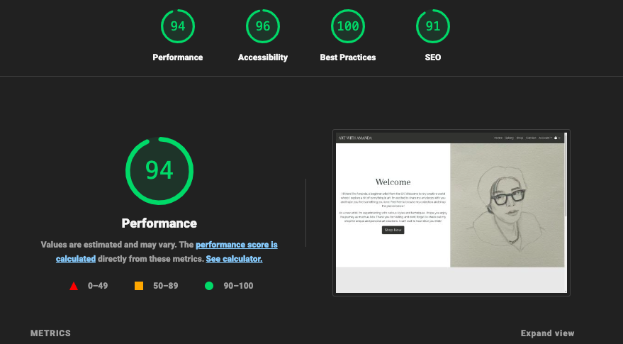
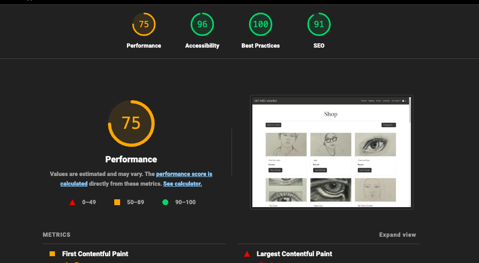
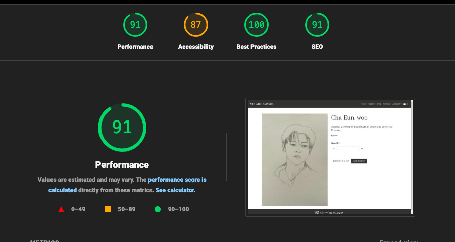
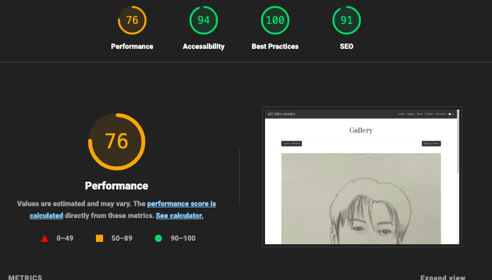
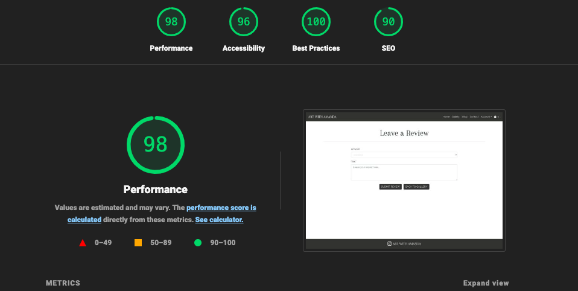
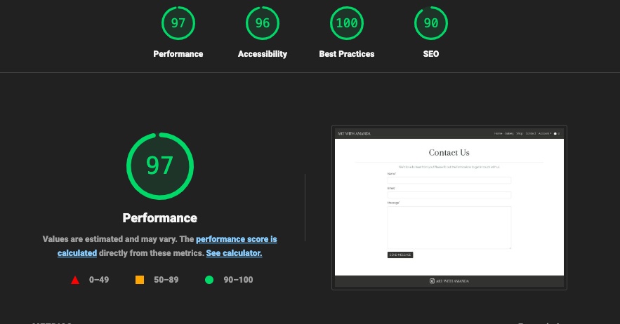
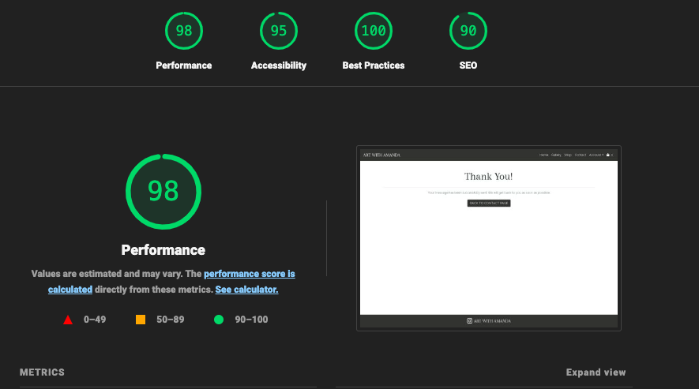
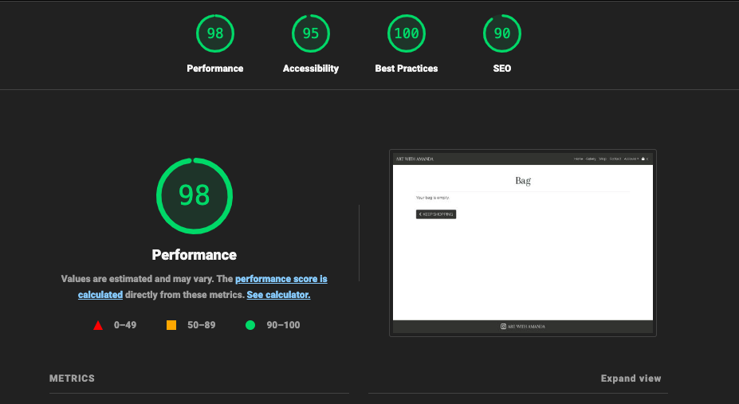

# ARTWITHAMANDA Testing

## Table of Contents
1. [Introduction](#introduction)
2. [Bugs](#bugs)
   - [Solved Bugs](#solved-bugs)
   - [Deployment Bug](#deployment-bug)
3. [Known Bugs](#known-bugs)
4. [Validation](#validation)
   - [HTML, CSS, JS Validation](#html-css-js-validation)
   - [Python Validation](#python-validation)
5. [Lighthouse Testing](#lighthouse-testing)
6. [User Stories Testing](#user-stories-testing)

## Introduction

Testing is a crucial aspect of the development process for the "Art with Amanda" website. From the start of the project to its completion,  testing was conducted to ensure the functionality, usability, and reliability of the platform. This document outlines the various testing strategies used to deliver a seamless and robust user experience.

The website was tested on the following devices: 

- MacBook air 13 inch
- Ipad 7th Gen
- Iphone 12
- Iphone 12 mini

In addition, the website was tested using google chrome developer tools to ensure the responsiveness on different screen sizes by pressing all device options.

### Browser testing

The website was tested on the following browsers:

- Google Chrome
- Safari
- Firefox

## Bugs

### Solved Bugs
|**Num** | **Bug** | **Fix** |
| ----------- | ----------- | ---------- |
| 1 | Image initially located in the static files directory was moved to the media directory for better organization, but the image wasn’t showing up in `index.html`. | Added the media context processor to `settings.py` to ensure `MEDIA_URL` is accessible in templates. Updated the HTML link in `index.html` to use the correct media URL. This change ensures proper display of the image and aligns with best practices for managing media files in Django projects. |
| 2 | `loaddata` command was failing because the JSON file contained incorrect image paths with an extra `media/` prefix. | Removed the `media/` prefix from the `image` field in `artworks.json` to ensure the paths match the `MEDIA_URL` and `MEDIA_ROOT` configuration. Deleted existing data from the database, reimported it and re-ran `python3 manage.py loaddata` to correctly populate the database with the updated paths. |
| 3 | Dropdown menu not showing all 3 options, The dropdown menu only displayed the selected category and did not show “All Categories” or other categories. Users could not switch between different categories, which limited navigation options in the shop. | Updated the artworks.html template to include a link for “All Categories” and iterate over all categories to display them in the dropdown menu. Ensured Bootstrap and jQuery libraries were properly included for dropdown functionality.|
| 4 | Dropdown menu showed all selected categories instead of only the current category when changing filters. | Updated artworks.html template to show only the selected category and added “All Categories” option to clear the current filter. Applied CSS to highlight the active dropdown item with a light grey background. |
| 5 | “Back to Home” Button Moves Up on Smaller Screens so it's not aligned with the categories button | Resolved by updating the Bootstrap classes used for the “Back to Home” button and the categories button. Adjusted the CSS classes to ensure consistent alignment across different screen sizes. |
| 6 | Incorrect location for bag.html template. Forgot to create a bag folder in the templates directory and initially placed bag.html in the wrong directory. |Created a bag folder within the templates directory and moved bag.html into it to ensure the bag page loads the correct template. |
| 7 | Quantity buttons for incrementing and decrementing were not functioning due to the missing  in base.html, which prevented the inclusion of the JavaScript file responsible for these actions. | Added the  section to base.html to ensure that the quantity_script.js JavaScript file is included in the template. This fix resolved the issue with the quantity buttons not functioning by ensuring that the JavaScript code for handling button clicks was properly loaded.|
| 8 | The remove button on artworks in the bag doesn't work when clicked, which prevents a user from removing an unwanted item from their bag.|   |

### Deployment Bug

**Bug Encountered During Deployment:**

During deployment, the application failed to build correctly when pushing to Heroku due to version incompatibility issues. The deployment process resulted in build failures because certain package versions were not compatible with each other or with the Heroku environment.

**Troubleshooting Steps:**

1. **Issue Identification:**
   - The build failed with errors related to version incompatibilities between packages.

2. **Initial Troubleshooting:**
   - Attempted to resolve the issue by debugging and changing package versions but did not achieve a successful build.

3. **Seeking Support:**
   - Contacted the Code Institute tutor for support, which provided guidance on resolving the issue.

4. **Solution:**
   - **Adjusted Package Versions:**
     - Set `setuptools` to version `58.0.4`.
     - Updated `Django Allauth` to version `0.50.0`.
   - **Created `runtime.txt`:**
     - Added a `runtime.txt` file to specify the Python version as `python-3.10.14`.
   - **Added `env.py`:**
     - Created an `env.py` file to securely store the secret key.

5. **Final Deployment:**
   - With the correct package versions and configurations in place, redeployed the application successfully.

**Resolution:** After making the necessary adjustments to package versions and configurations, the build process completed successfully, and the application was deployed without issues.

### Additional Updates

**Runtime File:**

- **`runtime.txt`:** Created a `runtime.txt` file in the root directory to specify the Python version to be used in the Heroku environment. This file includes:
  ```plaintext
  python-3.10.14

### **Remove Button Bug**

**Issue with "Remove Me" Button on Shop Page:**

- **Description**: The "Remove Me" button on the shop page does not remove the item from the cart.
- **Steps to Reproduce**:
  1. Add an item to the cart.
  2. Navigate to the shop page.
  3. Click the "Remove Me" button next to an item.
- **Expected Result**: The item should be removed from the cart.
- **Actual Result**: The item remains in the cart.
- **Status**: Debugging the button's functionality and ensuring the cart is updated correctly upon item removal.

**Troubleshooting Steps:**

1. **Identify the Problem**:
   - Verified that the "Remove Me" button was correctly linked to the `remove_from_bag` view function.

2. **Check Button ID**:
   - Noticed that the ID of the remove button was previously set to `item.artwork.artwork_id`, which was incorrect.

3. **Update Button ID**:
   - Changed the button ID to `item.artwork.id` to correctly reflect the item’s ID.

4. **Add Debugging Statements**:
   - Added print statements in the `remove_from_bag` view function to track the flow and verify data.
   - Example print statement:
     ```python
     print(f"Attempting to remove artwork with ID: {artwork_id}")
     ```

5. **Verify URL Handling**:
   - Set `DEBUG` to `True` in Django settings to see detailed error messages.
   - Observed that the URL was incorrect. Adjusted the URL configuration by removing unnecessary parts.

6. **Update and Test**:
   - Modified the URL configuration to ensure the correct route was used for removing items.
   - Successfully tested that the item was removed from the cart after the adjustment.

**Resolution**: After updating the button ID and correcting the URL configuration, the "Remove Me" button functionality was restored, and items are now correctly removed from the cart.

### **500 Server Error on Contact Form Submission**

**Issue with Contact Form Submission:**

- **Description**: Submitting the contact form results in a 500 Server Error, despite the email being successfully sent.
- **Steps to Reproduce**:
  1. Fill out the contact form.
  2. Submit the form.
- **Expected Result**: A confirmation message should appear, indicating that the email has been sent successfully.
- **Actual Result**: A 500 Server Error page is displayed, even though the email is sent.

**Troubleshooting Steps:**

1. **Identify the Problem**:
   - Verified that the email is sent successfully but observed a 500 Server Error upon form submission.

2. **Review Error Logs**:
   - Checked server logs to pinpoint the cause of the 500 Server Error.

3. **Inspect `contact` View Function**:
   - Reviewed the `contact` view function for potential issues.
   - Confirmed the function redirects to the `success` URL instead of `contact:success`.

4. **Update URL Configuration**:
   - Changed the redirect URL in the `contact` view function from `'contact:success'` to `'success'`.
   - Updated `urls.py` to ensure the `success` route is correctly defined:
     ```python
     urlpatterns = [
         path('', views.contact, name='contact'),
         path('success/', views.success_view, name='success'),
     ]
     ```

5. **Check Template Rendering**:
   - Reviewed the `contact/success.html` template to ensure it does not contain errors that could cause a 500 error.

6. **Update View Layout**:
   - Changed the layout of the `success_view` function to ensure proper rendering and handling:
     ```python
     def success_view(request):
         return render(request, 'contact/success.html')
     ```

7. **Test and Verify**:
   - Re-tested the contact form submission to confirm that the 500 Server Error is resolved.
   - Verified that the confirmation message is displayed correctly after submission.

**Resolution**: By updating the redirect URL to `'success'` and changing the layout of the `success_view` function, the 500 Server Error was resolved. The contact form submission now correctly displays the confirmation message.


## Known Bugs

### Footer Display Issue on Mobile
- **Description**: On mobile screens, the footer does not stick to the bottom of the home page, leaving a gap below it.
- **Steps to Reproduce**: 
  1. Open the home page on a mobile device or resize the browser to a mobile screen size.
  2. Scroll to the bottom of the page.
- **Expected Result**: The footer should be fixed at the bottom of the page.
- **Actual Result**: The footer appears higher up, leaving an empty space below it.
- **Status**: Currently investigating CSS and layout adjustments to ensure the footer remains at the bottom on all screen sizes.

### Ongoing Fixes
I am actively working on fixing these issues and will provide updates on the progress. Each bug is being carefully reviewed, and solutions are being implemented and tested to ensure they are resolved. Please check back for updates on these issues.

## HTML,CSS,JS Validation

### HTML Validation

W3C [HTML Validator](https://validator.w3.org/) was be used to validate the HTML on all pages of the site.

| Page                  | Result | Evidence |
| :--- | :--- | :---: |
| Home Page             |   Pass     | [Homepage](documentation/HTMLval/hp-html.png) |
| Shop Page             |   Pass     | [Shop](documentation/HTMLval/shop-html.png) |
| Artwork Detail Page   |    Pass    | [ArtDetail](documentation/HTMLval/artdetail-html.png)|
| Gallery Page          |    Pass    | [Gallery](documentation/HTMLval/gallery-html.png) |
| Review Page           |    Pass    | [Review](documentation/HTMLval/review-html.png) |
| Contact Page          |    Pass    | [Contact](documentation/HTMLval/contact-html.png)|
| Contact Success Page  |    Pass    | [ContactSuccess](documentation/HTMLval/contact-success-html.png) |
| Bag Page              |   Pass     | [Bag](documentation/HTMLval/bag-html.png) |
| Checkout Page         |    Pass    | [Checkout](documentation/HTMLval/checkout-html.png) |
| Checkout Success Page |    Pass    | [CheckoutSuccess](documentation/HTMLval/checkout-success-html.png) |
| Account Page          |    Pass    | [Account](documentation/HTMLval/account-html.png) |
| Login Page            |    Pass    | [Login](documentation/HTMLval/login-html.png)|
| Register Page         |    Pass    | [Register](documentation/HTMLval/register-html.png)|
| Add Page              |    Pass    | [Add artwork](documentation/HTMLval/add-html.png)|
| Edit Page             |    Pass    | [Edit artwork](documentation/HTMLval/edit-html.png)|

### CSS

[W3C](https://validator.w3.org/) was used to validate the CSS.

| File | Result | Evidence |
| :--- | :--- | :---: |
| static/css/base.css | Pass | [base.css](documentation/CSSval/cssval1.png) |
| checkout/static/checkout/css/checkout.css | Pass | [checkout.css](documentation/CSSval/cssval2.png)|
| accounts/static/accounts/css/account.css | Pass | [account.css](documentation/CSSval/cssval3.png) |

### JavaScript

[JS Hint](https://jshint.com/) was used to validate the JavaScript.

| File | Result | Evidence |
| :--- | :--- | :---: |
| checkout/static/checkout/js/stripe-elements.js | Pass | [stripe-elements.js](documentation/JSval/jsval.png) |

## Python Validation

Python code quality was ensured through adherence to PEP 8 guidelines using `flake8`. This tool was employed to check for compliance with Python's style guide and to identify potential errors in the codebase.

### Process

1. **Integration of `flake8`**:
   - `flake8` was used to enforce PEP 8 style guidelines and detect potential issues within the Python code. This tool was integrated into the development workflow via GitPod, where it provided real-time feedback on code quality.

2. **Running `flake8`**:
   - The `flake8` tool was executed across all Python files in the project to identify any deviations from standard coding practices.
   - It checked for common issues such as code style violations, indentation errors, and potential logical problems.

3. **Issue Identification**:
   - The `flake8` tool generated reports highlighting areas where the code did not meet PEP 8 standards or where potential errors were detected.
   - Common issues identified included long lines, incorrect indentation, and unused imports.

4. **Issue Resolution**:
   - Detected issues were reviewed and corrected to ensure compliance with PEP 8 guidelines.
   - Corrections were made to enhance code readability and maintainability.

## Lighthouse Testing

I used Googles Lighthouse testing to test the performance, accessibility, best practices and SEO of the site.

| Page                  | Result |
| :---: | :---: |
| Home Page             | |          
| Shop Page             | |          
| Artwork Detail Page   | |          
| Gallery Page          | |          
| Review Page           | |          
| Contact Page          | |          
| Contact Success Page  | |          
| Bag Page              | |          
      
## User Stories Testing

| **User Story ID** | **Test Case ID** | **Description** | **Preconditions** | **Test Steps** | **Expected Result** | **Status** | **Comments** |
| :--- | :--- | :--- | :--- | :--- | :--- | :--- | :--- |
| **VIEWING & NAVIGATION** | TC01 | Test navigation through site | Home page is loaded | 1. Click on various menu items.<br>2. Navigate to different sections. | User can navigate to all sections easily. | | |
|  | TC02 | Test contacting the artist | Contact form is available | 1. Fill out the contact form.<br>2. Submit the form. | Contact form submits successfully, and an acknowledgment is displayed. | | |
|  | TC03 | Test artist information page | Artist information page exists | 1. Navigate to the artist's info page.<br>2. Check for biography and background. | Artist's background and journey are visible. | | |
|  | TC04 | Test viewing artwork by category | Categories are available | 1. Select a category from the dropdown.<br>2. Verify displayed artworks. | Only artworks from the selected category are displayed. | | |
|  | TC05 | Test viewing artwork details | Artwork details are available | 1. Click on an artwork.<br>2. View details page. | Artwork details, including descriptions, dimensions, and materials, are visible. | | |
|  | TC06 | Test running total of purchases | Cart is updated | 1. Add items to cart.<br>2. View running total. | Running total is updated correctly as items are added. | | |
| **REGISTRATION & USER ACCOUNTS** | TC07 | Test account registration | Registration page is available | 1. Fill out the registration form.<br>2. Submit the form. | Account is created, and confirmation message is shown. | | |
|  | TC08 | Test email confirmation for registration | Registration is complete | 1. Check email inbox.<br>2. Verify confirmation email. | Confirmation email is received and contains correct information. | | |
|  | TC09 | Test login and logout functionality | User account is registered | 1. Log in with valid credentials.<br>2. Log out. | User can log in and out successfully. | | |
|  | TC10 | Test viewing profile page | User is logged in | 1. Navigate to profile page.<br>2. Check previous orders and info. | Previous orders and profile info are visible. | | |
|  | TC11 | Test password reset functionality | User account is active | 1. Request password reset.<br>2. Follow reset instructions. | Password is reset, and user can log in with the new password. | | |
| **SORTING & SEARCHING** | TC12 | Test sorting artworks | Artworks are listed | 1. Sort artworks by price.<br>2. Verify sorting order. | Artworks are sorted correctly by price. | | |
|  | TC13 | Test sorting within a category | Category page is loaded | 1. Sort artworks by name in a category.<br>2. Verify sorting order. | Artworks are sorted correctly by name. | | |
|  | TC14 | Test search results and count | Search functionality is available | 1. Perform a search.<br>2. Check search results and count. | Search results and count match the query. | | |
| **PURCHASING & CHECKOUT** | TC15 | Test selecting size and quantity | Artwork is available for purchase | 1. Select size and quantity.<br>2. Add to cart. | Size and quantity are selected correctly. | | |
|  | TC16 | Test viewing items in the bag | Items are in the bag | 1. Navigate to the bag.<br>2. Verify items and total cost. | All items and the total cost are displayed correctly. | | |
|  | TC17 | Test adjusting quantity in the bag | Items are in the bag | 1. Adjust item quantities.<br>2. Verify changes. | Quantities are adjusted correctly in the bag. | | |
|  | TC18 | Test entering payment information | Checkout page is loaded | 1. Enter payment details.<br>2. Proceed with payment. | Payment information is entered and processed successfully. | | |
|  | TC19 | Test security of payment information | Checkout page is loaded | 1. Enter payment details.<br>2. Verify secure connection. | Payment information is securely processed. | | |
|  | TC20 | Test order confirmation page | Checkout is complete | 1. Complete the checkout process.<br>2. Verify confirmation page. | Order confirmation is displayed. | | |
|  | TC21 | Test email confirmation after checkout | Checkout is complete | 1. Check email inbox.<br>2. Verify confirmation email. | Confirmation email is received and accurate. | | |
| **ADMIN & STORE MANAGEMENT** | TC22 | Test adding new artwork | Admin is logged in | 1. Navigate to artwork management.<br>2. Add new artwork details. | New artwork is added and visible on the site. | | |
|  | TC23 | Test editing artwork details | Existing artwork is available | 1. Edit artwork details.<br>2. Save changes. | Artwork details are updated correctly. | | |
|  | TC24 | Test deleting artwork | Existing artwork is available | 1. Delete artwork.<br>2. Verify removal. | Artwork is removed from the site. | | |

